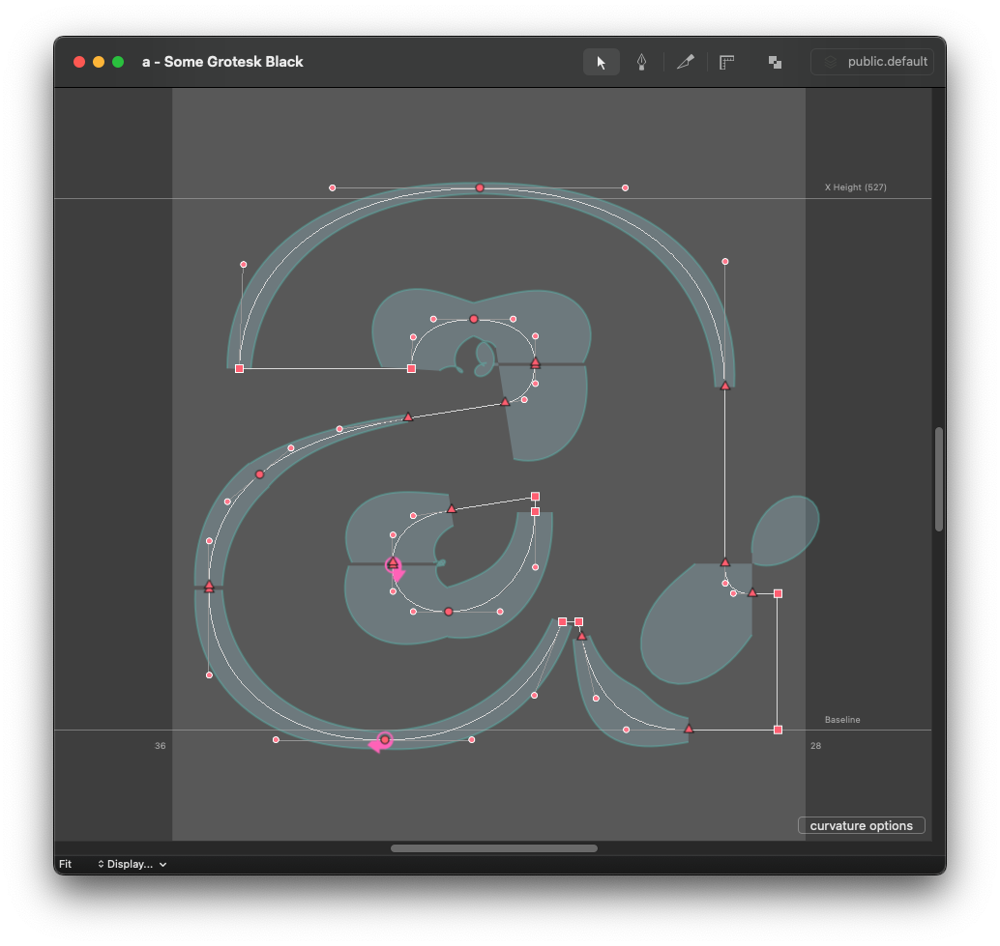
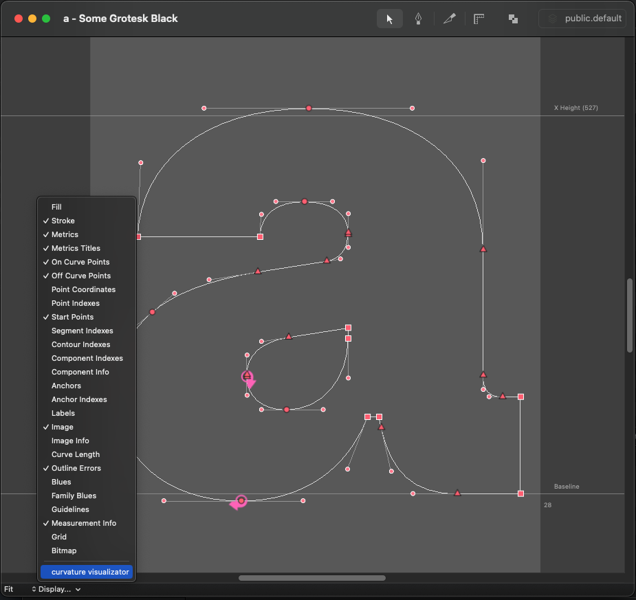

# Curvature Visualizator

I must give credit to the amazing [Primer on Bézier curves](https://pomax.github.io/bezierinfo/) and [SpeedPunk](https://github.com/yanone/speedpunk), as they were instrumental in creating this repository. Although it may appear similar, the code is tailored specifically to its creator, making it more intuitive to use. Additionally, it only operates within the RoboFont environment, which simplifies the process. Thanks to this, incorporating support for quadratic curves was a straightforward task, unlike SpeedPunk, which currently lacks this feature.

## How does it work?

Basically, it adds a checkbox button to the **Display…** menu of the Glyph Edit Window.

All you need to do is activate it.

You can access more options by clicking on the **Curvature Options** button located in the bottom-right corner of the Glyph Editor window.

**Visualization Size** controls how big the curvature representation is going to be.

**Visualization Type** lets you decide which side of the outline will have its representation.

**Zoom Visualization** is a cool feature which will scale the whole curvature representation together with the zoom factor of your Glyph Editor window.

To access additional settings, navigate to the menu item: **Extensions > Curvature Visualizator > Settings..**.

---

Maybe it is pointless or unnescessary, but I would like to share my opinion on tools like these:

- Remember, this is no more and no less than a tool.
- You should always use your own judgment whenever you are creating. Making every curvature "smooth" without the slightest brainwork will probably reflect in boring or repetitive designs.
- You should know your tool; you should understand what it does. And, I think, you should control it and not let it control you.
- Have fun using it. :)
